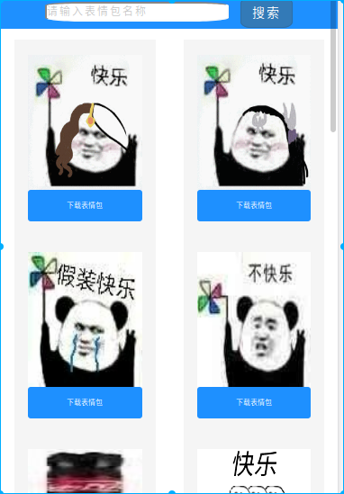
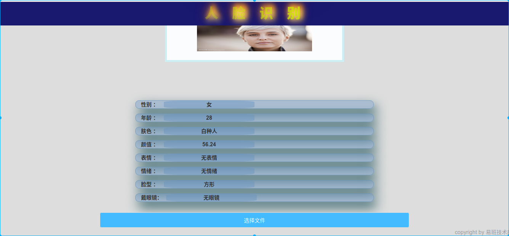
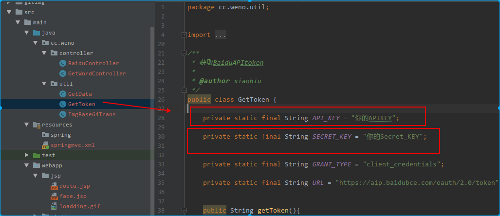

## 易班图片网站

网站主要是分为两个部分：

- 斗图网站

- 图片颜值查询

### 斗图网站

斗图网站是接入斗图啦网站的API，[地址](https://www.doutula.com/)

网页后台使用的是maven构建项目，springmvc框架。前端由吴逸尘所写，使用的是jsp构建前段页面。

网站效果如下所示

网站有上一页和下一页的功能，并提供搜索。

### 图片颜值查询

图片颜值查询接入的是百度的API，技术[文档参考](http://ai.baidu.com/docs#/Face-Detect-V3/top)

然后前端依旧是由吴逸尘所写。页面如下

使用时注意写入自己的申请的百度API

Springmvc学习参考,[博客](https://www.cnblogs.com/xiaohuiduan/category/1349988.html)

环境部署参考[博客](https://www.cnblogs.com/xiaohuiduan/p/9961398.html)